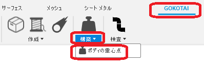
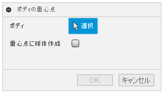
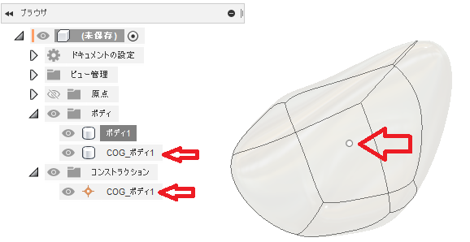

# **ボディの重心点**

本コマンドは、指定したボディの重心位置に構築点を作成します。

---

## **使用法** :

アドイン起動後は、"GOKOTAI" - "構築" 内に "ボディの重心点" コマンドが追加されます。

クリックする事でダイアログが表示されます。

- ボディ：該当のボディを選択してください。
  - メッシュボディは対象外です。
  - プレビュー中はボディの不透明度を変化させますが、一時的な処理です。

---

## **成果物** :

以下のようなに構築点が作成されます。

+ ボディと同じコンポーネント内に作成されます。

+ ”COG_<ボディ名>” の名称で作成されます。

---

## **アクション** :

以下の環境で確認しています。

- Fusion360 Ver2.0.13881
- Windows10 64bit Pro , Home

---

## **ライセンス** :

- MIT

---

## 謝辞 :

- [日本語フォーラム](https://forums.autodesk.com/t5/fusion-360-ri-ben-yu/bd-p/707)の皆さん、ありがとう。
