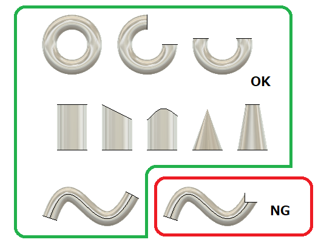

# **中心線長さ**

本コマンドは、選択されたパイプ形状の合計長さ測定します。

---

## **使用法** :

アドイン起動後は、"GOKOTAI" - "検査" 内に "中心線長さ" コマンドが追加されます。

クリックする事でダイアログが表示されます。

- 面：該当の面を選択してください。
  - 選択可能な面の形状は、"シリンダー" "コーン" "トーラス" のみです。
  

- 合計長さ：選択されたパイプ形状の合計長さ測定します。
- 結果をスケッチで作成：こちらにチェックを入れ"OK"を押すとセンターラインを描いたスケッチが、ルートコンポーネントに作成されます。

- 実行中は、選択面のボディの不透明度を50％に一時的に変更します。
- 算出した中心線を緑色で表示します。
- 合計長さはツールチップでも表示させています。

---

## **成果物** :

"結果をスケッチで作成”にチェックを入れ"OK"を押した場合、プレビュー時の中心線を、スケッチの線としてルートコンポーネントに作成します。

---

## **アクション** :

以下の環境で確認しています。

-  Fusion360 Ver2.0.13162
- Windows10 64bit Pro , Home

---

## **ライセンス** :

- MIT

---

## 謝辞 :

- [日本語フォーラム](https://forums.autodesk.com/t5/fusion-360-ri-ben-yu/bd-p/707)の皆さん、ありがとう。
