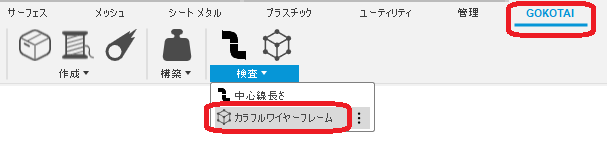
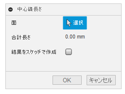
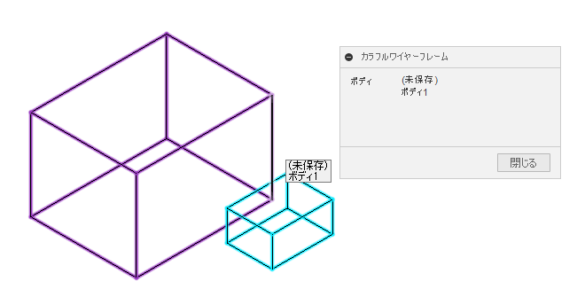

# **色付きワイヤーフレーム表示**

本コマンドは、色付きのワイヤーフレーム表示を行います。但し非常に遅いです。

---

## **使用法** :

アドイン起動後は、"GOKOTAI" - "検査" 内に "カラフルワイヤーフレーム" コマンドが追加されます。

クリックする事でダイアログが表示されます。

マウスカーソルをワイヤーフレーム上に移動させる事で、コンポーネント名・ボディ名をダイアログとツールチップに表示させます。

  

---

## **アクション** :

以下の環境で確認しています。

- Fusion360 Ver2.0.14567
- Windows10 64bit Pro , Home

---

## **ライセンス** :

- MIT

---

## 謝辞 :

- [日本語フォーラム](https://forums.autodesk.com/t5/fusion-360-ri-ben-yu/bd-p/707)の皆さん、ありがとう。
