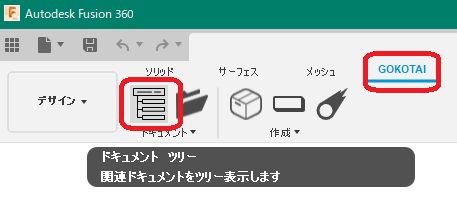
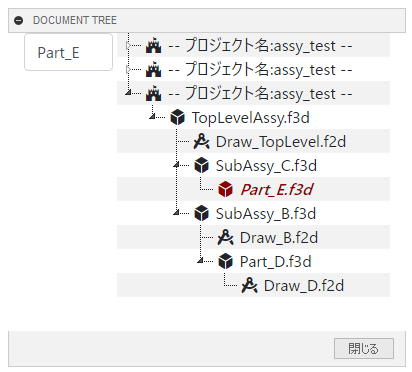
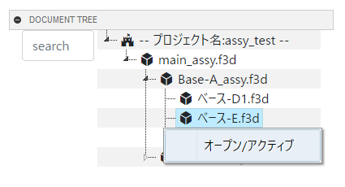

# **ドキュメント ツリー**

本コマンドは、アクティブなドキュメントに関連するドキュメントをツリー表示します。
ブラウザツリーのコンポーネントのツリーでは無く、関連ドキュメントのツリーです。

---

## **使用法** :

アドイン起動後は、"GOKOTAI" - "ドキュメント"  内に "ドキュメント ツリー" コマンドが追加されます。

クリックする事でダイアログが表示されます。(時間がかかります)

---

## **機能** :
+ 検索
 ツリーに表示されている文字内から検索し、色を変えて表示させます。(大文字小文字の区別なし)

+ オープン/アクティブ(コンテキストメニュー)

  ドキュメントをオープン又はアクティブにします。

  + 開かれていないドキュメント：オープン
  + 開かれているドキュメント：アクティブ

---

## **注意** :

- PCB関連は対象外です。

---

## **アクション** :

以下の環境で確認しています。

- Fusion360 Ver2.0.17710
- Windows10 64bit Pro , Home

---

## **ライセンス** :

- MIT

---

## 謝辞 :

- [日本語フォーラム](https://forums.autodesk.com/t5/fusion-360-ri-ben-yu/bd-p/707)の皆さん、ありがとう。