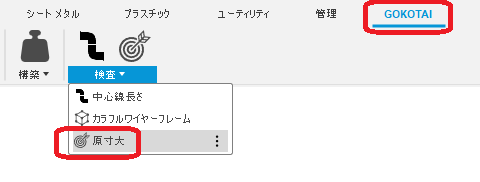
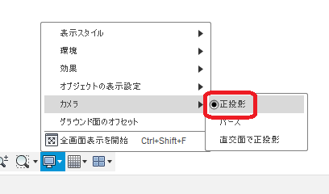

# **原寸大**

本コマンドは、画面を原寸大のサイズになるようにズームします。

---

## **使用法** :

アドイン起動後は、"GOKOTAI" - "検査" 内に "原寸大" コマンドが追加されます。

クリックする事で原寸大のサイズになるようにズームを調整します。

+ 事前にカメラを "正投影" に切り替えておく必要があります.

  

---

## **アクション** :

以下の環境で確認しています。

- Fusion360 Ver2.0.14567
- Windows10 64bit Pro , Home

---

## **ライセンス** :

- MIT

---

## 謝辞 :

- [日本語フォーラム](https://forums.autodesk.com/t5/fusion-360-ri-ben-yu/bd-p/707)の皆さん、ありがとう。
