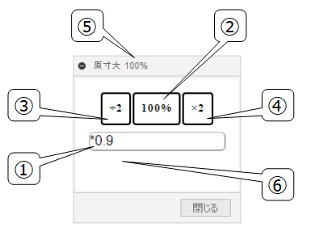
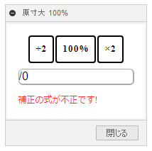

# **原寸大**

本コマンドは、画面を原寸大のサイズになるようにズームします。

---

## **使用法** :

アドイン起動後は、"GOKOTAI" - "検査" 内に "原寸大" コマンドが追加されます。

クリックする事でダイアログが表示され、原寸大のサイズになるようにズームを調整されます。現状は正しいサイズにならない為、補正値を利用し調整してください。

+ ①: 数式(半角文字)のような記述で補正を行います。 変更を行った際は、100％表示に強制されます。主だった演算子は以下のものがあります。※pythonのeval関数で演算しており、他の演算子も利用可能なものはあります。(math.pi等)

| | 演算子 |
| :---: | :---: |
| 加算 | + |
| 減算 | - |
| 加算 | * |
| 減算 | / |
| 余り | % |
| 累乗 | ** |

+ ②: 補正を考慮した100%表示にします。
+ ③: クリックする度に表示するパーセンテージを半分にします。
+ ④: クリックする度に表示するパーセンテージを2倍にします。
+ ⑤: ボタンをクリックした際のパーセンテージを表示します。(手動でズームさせた際の実際のパーセンテージではありません。)
+ ⑥: 補正の設定に不具合がある場合には、警告が表示されズームが調整されません。こちらはゼロ除算によるエラーです。

+ モニター上の表示サイズが小さい場合は、答えが小さくなる式を設定する事で実際のサイズに近づける事が出来ます。

+ ”補正”は、前回使用した値が保存されます。

+ 事前にカメラを "正投影" に切り替えておく必要があります.

  

---

## **アクション** :

以下の環境で確認しています。

- Fusion360 Ver2.0.14569
- Windows10 64bit Pro , Home

---

## **ライセンス** :

- MIT

---

## 謝辞 :

- [日本語フォーラム](https://forums.autodesk.com/t5/fusion-360-ri-ben-yu/bd-p/707)の皆さん、ありがとう。
