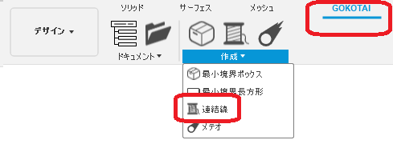
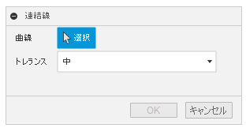
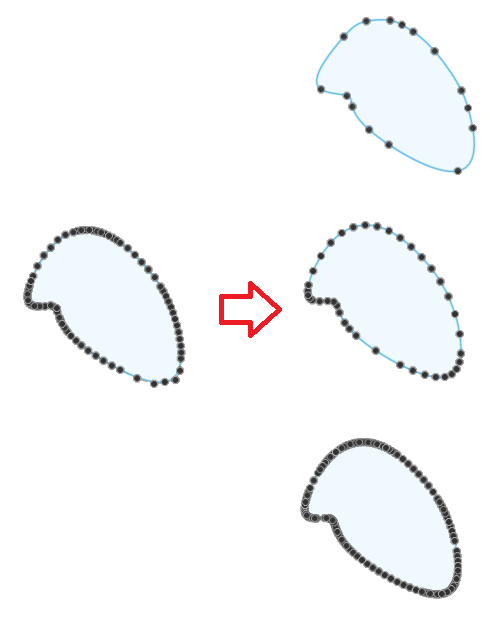

# **連結線**

本コマンドは、指定したスケッチの連続した線を、一本の曲線に連結し新たなスケッチを作成します。

---

## **使用法** :

アドイン起動後は、"GOKOTAI" - "作成" 内に "連結線" コマンドが追加されます。

クリックする事でダイアログが表示されます。

- 曲線：該当するスケッチの線を連続した状態で選択してください。
- トレランス：通過点を数を3段階で指定出来ます。(低・中・高)

---

## **成果物** :

"Joint Curve” と言う名前のスケッチが出来上がります。

トレランスにより、以下のような状態で通過点が異なります。

出来上がるスケッチは、指定したコンポーネントにより異なります。

+ ルートコンポーネント -> ルートコンポーネント内のスケッチ
+ 内部コンポーネント　-> 内部コンポーネント内のスケッチ
+ 外部コンポーネント(外部リンク付き) -> ルートコンポーネント内のスケッチ

---

## **アクション** :

以下の環境で確認しています。

- Fusion360 Ver2.0.12888
- Windows10 64bit Pro , Home

---

## **ライセンス** :

- MIT

---

## 謝辞 :

- [日本語フォーラム](https://forums.autodesk.com/t5/fusion-360-ri-ben-yu/bd-p/707)の皆さん、ありがとう。
