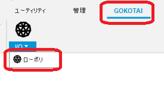
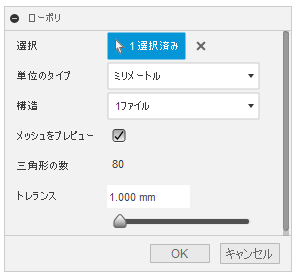
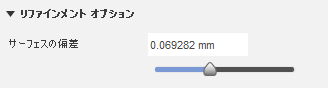
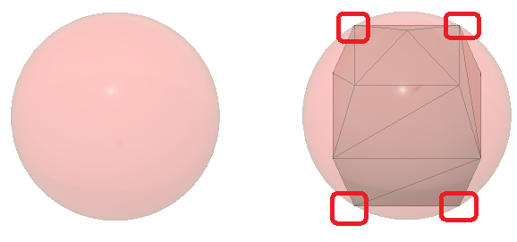
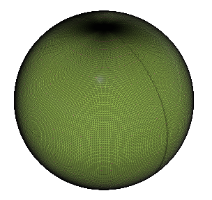
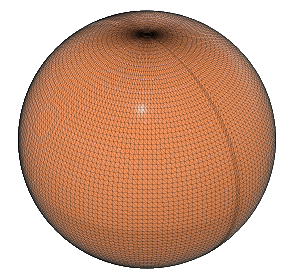
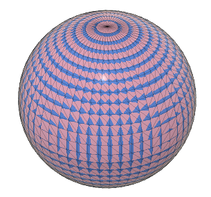
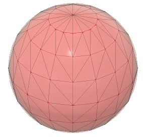
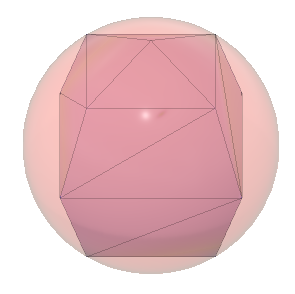

# **ローポリ**

本コマンドは、指定したボディをローポリゴンSTLファイルとしてエクスポートします。
標準コマンド"メッシュとして保存"よりローポリゴンの出力が可能です。

---

## **使用法** :

アドイン起動後は、"GOKOTAI" - "I/O" 内に "ローポリ" コマンドが追加されます。

クリックする事でダイアログが表示されます。

- 選択：該当のボディ又はコンポーネントを選択してください。
  - メッシュボディは対象外です。
  - 任意の複数のボディの選択が可能です。
- 単位のタイプ：エクスポートする際の単位を選択します。
  - 'センチメートル' 'ミリメートル' 'メートル' 'インチ' 'フィート'の5種類です。
- 構想:複数のボディを選択した際のエクスポートするファイルの分割方法です。
  - '1ファイル':全てのボディを1ファイルでエクスポートします。
  - 'ボディ毎に1ファイル':指定ボディ毎にエクスポートします。指定したファイル名+コンポーネント名+ボディ名のファイルとなります。
- トレランス：ポリゴンの精度を指定します。標準"メッシュとして保存"コマンドの"サーフェスの偏差"に該当するもので、数値が大きくなる程、面の数が減ります。(限度はあります)

  

---

## **成果物** :

"メッシュ"の"削減"コマンドで面の数を減らす事は可能ですが、"削減"後のメッシュは全体的に変形します。

本コマンドで作成されたSTLの場合、形状はローポリゴンとなりますが頂点に関しては元のソリッド/サーフェス上と一致した状態を保証します。

φ100の球体に対しトレランス別に出来上がったSTLを比較します。

- トレランス：0.001mm

- トレランス：0.01mm

- トレランス：0.1mm

- トレランス：1mm

- トレランス：20mm

---

## **問題/課題** :

・プレビュー機能が無い。

・~~コンポーネント内のボディが正しい位置にエクスポートされない。~~

・~~コンポーネントが指定出来ない。~~

---

## **アクション** :

以下の環境で確認しています。

- Fusion360 Ver2.0.15027
- Windows10 64bit Pro , Home

---

## **ライセンス** :

- MIT

---

## 謝辞 :

- [日本語フォーラム](https://forums.autodesk.com/t5/fusion-360-ri-ben-yu/bd-p/707)の皆さん、ありがとう。
