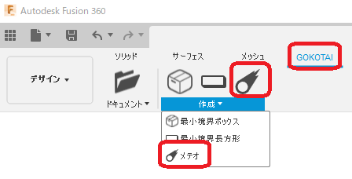
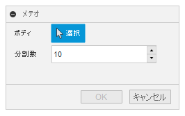
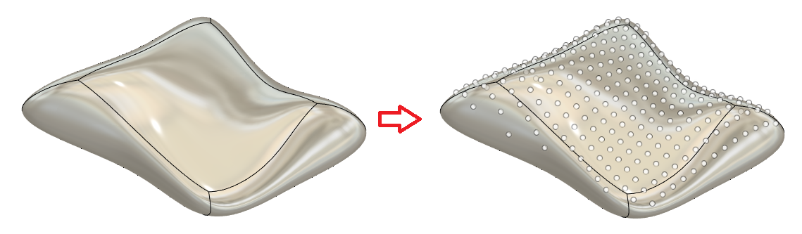

# **メテオ**

本コマンドは、指定したボディにZの上方向から大量の点を降り注ぎます。
・・・ザックリです。

---

## **使用法** :

アドイン起動後は、"GOKOTAI" - "作成" 内に "メテオ" コマンドが追加されます。

クリックする事でダイアログが表示されます。

- ボディ：該当のボディを選択してください。
- 分割数：ボディのサイズに対して大まかな点を配置する目安です。

---

## **成果物** :

以下のような多数の点が描かれたスケッチが作成されます。

---

## **注意** :

- ルートコンポーネント以外のボディを指定した場合、正しい位置に作成されません。

---

## **アクション** :

以下の環境で確認しています。

- Fusion360 Ver2.0.12392
- Windows10 64bit Pro , Home

---

## **ライセンス** :

- MIT

---

## 謝辞 :

- [日本語フォーラム](https://forums.autodesk.com/t5/fusion-360-ri-ben-yu/bd-p/707)の皆さん、ありがとう。
