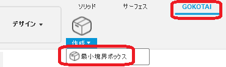
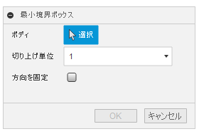
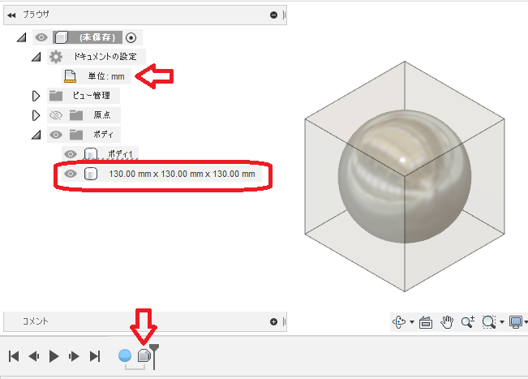

# **最小境界ボックス**

本コマンドは、ソリッドボディの最小(とは限らない)境界ボックスを作成します。
以下のような場面を想定しています。
- 歪な部品の大まかな材料寸法の確認。

---

## **使用法** :

アドイン起動後は、"GOKOTAI" - "作成" 内に "最小境界ボックス" コマンドが追加されます。

クリックする事でダイアログが表示されます。

- ボディ：該当のボディを選択してください。
- 切り上げ単位：端数となる事を避け、測定結果の数値を切上げます。
  - 無し：結果を変更せずそのままとします。
  - 0.001:0.001まで切り上げます。
  - 0.01:0.01まで切り上げます。
  - 0.05:0.05まで・・・以下は大体察して下さい。

- 方向を固定:トップレベルの原点のXYZ方向に固定した向きで測定を行います。

※長さの単位は、ドキュメントの単位に依存しています。

---

## **成果物** :

以下のような半透明のボディが作成されます。

- 指定したボディと同一のコンポーネント内に作成されます。
- 作成されたボディの名前は、ブロックのサイズとなります。

---

## **注意** :

- 作成されたボディの不透明度については、変更しても元に戻るバグが確認されています。詳しくは[こちら](https://forums.autodesk.com/t5/fusion-360-ri-ben-yu/bodino-bu-tou-ming-duga-wei-chisarenai/td-p/10981209)。(Ver2.0.12392)

---

## **アクション** :

以下の環境で確認しています。

- Fusion360 Ver2.0.12392
- Windows10 64bit Pro , Home

---

## **ライセンス** :

- MIT

---

## 謝辞 :

- [日本語フォーラム](https://forums.autodesk.com/t5/fusion-360-ri-ben-yu/bd-p/707)の皆さん、ありがとう。
