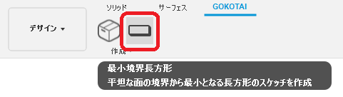
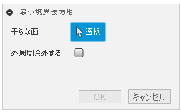
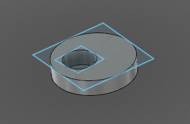

# **最小境界長方形**

本コマンドは、平坦な面の境界から最小となる長方形のスケッチを作成します。

---

## **使用法** :

アドイン起動後は、"GOKOTAI" - "作成" 内に "最小境界長方形" コマンドが追加されます。

クリックする事でダイアログが表示されます。

- 平らな面：該当のボディの面を選択してください。
- 外周を除外する：チェックを入れると選択面の外周部には処理を行いません。

※長さの単位は、ドキュメントの単位に依存しています。

---

## **成果物** :

以下のような複数の四角が描かれたスケッチが作成されます。

---

## **アクション** :

以下の環境で確認しています。

- Fusion360 Ver2.0.12392
- Windows10 64bit Pro , Home

---

## **ライセンス** :

- MIT

---

## 謝辞 :

- [日本語フォーラム](https://forums.autodesk.com/t5/fusion-360-ri-ben-yu/bd-p/707)の皆さん、ありがとう。
