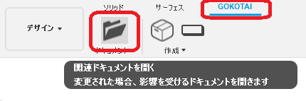

# **関連ドキュメントを開く(Open Affected Documents)**

本コマンドは、アクティブなドキュメントに関連するドキュメントを開く事をサポートしています。
以下のような場面を想定しています。
- 部品ファイルに変更を加えた際、更新を必要とするAssyファイル・図面ファイルの検索軽減。
- f3zを受け取りUploadした後、トップレベルファイルの検索軽減。
- 複数人で共同設計を行っているプロジェクトのトップレベルファイルの検索軽減。
- f3dからf2d呼び出しの軽減。

---

## **使用法** :

アドイン起動後は、"GOKOTAI" - "ドキュメント"  内に "関連ドキュメントを開く" コマンドが追加されます。



クリックする事でダイアログが表示されます。


開く必要のないものはチェックを外し、OKを押す事でドキュメントが開かれます。

---

## **関連ドキュメント** :

"関連ドキュメント"と判断する基準です。
以下のような状態のデータ構造で、何れもリンク付きコンポーネントとします。
```
TopLevelAssy.f3d
 └ Draw_TopLevel.f2d
 └ SubAssy_B.f3d
  └ Draw_B.f2d
  └ Part D.f3d
   └ Draw_D.f2d
 └ SubAssy_C.f3d
  └ Draw_C.f2d
  └ Part E.f3d
    └ Draw_E.f2d
```
一番低いレベルにある"Part D.f3d"を開いた状態の場合、"TopLevelAssy.f3d"が関連ドキュメントとして判断します。

又、"Part D.f3d"～"TopLevelAssy.f3d"間の図面(f2d)ファイルも変更の影響が出ている可能性が有る為、
"Draw_D.f2d" "Draw_B.f2d" "Draw_TopLevel.f2d" も関連ドキュメントとして判断します。

---

## **注意** :

- PCB関連は対象外です。
- 現在は、ドキュメントを開くのみで、更新・保存についてはサポートしておりません。

---

## **アクション** :

以下の環境で確認しています。

- Fusion360 Ver2.0.12392
- Windows10 64bit Pro , Home

---

## **ライセンス** :

- MIT

---

## 謝辞 :

- [日本語フォーラム](https://forums.autodesk.com/t5/fusion-360-ri-ben-yu/bd-p/707)の皆さん、ありがとう。
