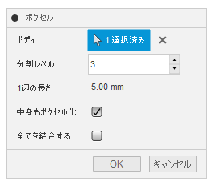

# **ボクセル**

本コマンドは、指定したボディを元にボクセル化したボディを作成します。

---

## **使用法** :

アドイン起動後は、"GOKOTAI" - "作成" 内に "ボクセル" コマンドが追加されます。

クリックする事でダイアログが表示されます。

- ボディ：該当のソリッドボディを選択してください。
- 分割レベル：ボクセル化する際の分割レベルを指定してください。数値が大きくなれば、より細かくなりますが処理時間が掛かります。（6以下推奨）
- 1辺の長さ:ボクセル化した際の最小サイズの立方体の辺の長さを表示します。
- 中身もボクセル化：チェックを入れると、完全に閉ざされている部分のボクセル化の有無の選択です。
  - 球体をボクセル化した際のチェックの有無の違いです。

  

- 全てを結合する：チェックを入れると、ボクセル化した際のボディを可能な限り結合し一体化します。
  - 球体をボクセル化した際のチェックの有無の違いです。

  
---

## **成果物** :

"voxel" と言う名称のコンポーネントが新作されボクセル化されたボディが入っています。

---

## **注意・問題点** :

- 処理終了後もコマンドのアイコンがクリックされた表示のままになる。

---

## **アクション** :

以下の環境で確認しています。

- Fusion360 Ver2.0.14793
- Windows10 64bit Pro , Home

---

## **ライセンス** :

- MIT

---

## 謝辞 :

- [日本語フォーラム](https://forums.autodesk.com/t5/fusion-360-ri-ben-yu/bd-p/707)の皆さん、ありがとう。
